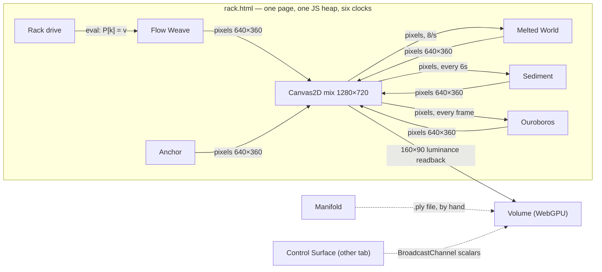
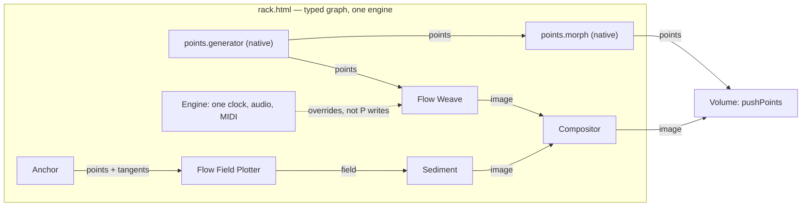

# The Unlimiter — architecture, and where it goes next

An audit of every tool, host and shared module in the repo (September 2026),
and a plan for turning a set of tools that *sit next to each other* into a
system whose tools *feed each other*.

The short version: today the only thing that crosses a tool boundary is a
flattened 640×360 picture, plus scalar modulation. Every tool computes
something much richer than a picture — oriented points, strokes, velocity
fields, depth in millimetres, masks — and all of it dies at the edge of its
iframe. The plan below gives that data a way out, in four types, through an
explicit port on each tool, patched in a Rack whose cables know what they
carry.

---

## 1. What each tool actually computes

The column that matters is **core data**: it is what could be shared, and
right now none of it is.

| Tool | Core data (what it really holds) | Renders | Params | In the Rack today |
|---|---|---|---|---|
| **Anchor** | `PATHS` — oriented points `{x,y,z,tx,ty,nx,ny,u}` as JS objects; binary mask; colour sampler | Canvas2D (`work`) | Drive, P/Q, NO_MOD | pulled from `work` |
| **Sediment** | `particles` — JS objects with per-particle RNG closures; velocity is implicit simplex, never stored | Canvas2D (`work` → `view`) | Drive, P/Q, NO_MOD | pulled from the **wrong canvas** |
| **Flow Field Plotter** | typed-array analysis field at 320×180 (`ori`, `ani`, `mag`, `flowX/Y`); fluid at 160×90; `paths` polylines `[x,y,speed,heading,z]` | WebGL2 + Canvas2D, two stacked canvases | legacy `modulation.js`, **inlined**; `P`/`E` | not hosted |
| **Flow Weave** | GPU fluid — `vel`/`press`/`dye` RGBA16F at 512×288; 65k particles living in a texture | WebGL2 | Drive via `mod` adapter; no presets | pulled |
| **Melted World** | nothing stored — one procedural displacement shader | WebGL2 | Drive via adapter; non-standard preset key | pushed |
| **Ouroboros** | HDR feedback ping-pong | WebGL2 | Drive, P/Q — the most standard of all | pushed; **input is black** |
| **Time Cube** | `TEXTURE_3D` ring buffer, 192×144×128 | WebGL2 | legacy `modulation.js` | not hosted |
| **Worldseed** | terrain exists **only in the vertex shader**; 150k transform-feedback particles; equirectangular paint/carve texture | WebGL2 | its own inline 3-slot mod system | not hosted |
| **Phylo L-system** | `segments` / `panels` / `leaves` as JS objects; 18-float instance buffers | WebGL2 | none — a plain `state` object | **unreachable** (IIFE) |
| **TBG Facade** | panel tree + world-space quads as `{x,y,z}` objects | Canvas2D | none | **unreachable** (IIFE) |
| **Manifold** | the points frame — parallel `Float32Array`s | WebGL2 | Drive, P/Q, built from metadata | not hosted |
| **Relief** | depth grid addressed by `gl_VertexID` | WebGL2 | Drive, P/Q + Depth | not hosted |
| **Volume** | 16-float packed sources, sorted per view | WebGPU | its own audio engine and bus copy | embedded; fed a 160×90 luma grid |

Read down the core-data column and "a set of points" is represented five
different ways: JS objects with tangents, JS objects with closures, nested
arrays, GPU textures, and typed arrays. Colour arrives as hex strings, `rgb()`
strings, 0–255 bytes and 0–1 floats. Coordinates live in canvas pixels at
BASE 1100, at BASE 1200, normalised 0–1, and in world units. None of that is
wrong inside one tool. It is exactly what makes sharing impossible between
them.

### Signals and parameters

| | Count | Detail |
|---|---|---|
| Audio analysers | **8** | drive, modulation.js, control-surface, volume-renderer, phylo, facade, worldseed, FFP's inlined copy |
| Independent clocks in one Rack page | **6** | the Rack's drive plus one per hosted tool; free-running beats drift apart unless everything receives MIDI clock |
| Signal vocabularies | **3** | drive (`audio.low`, `clock.beat`), bus (`band.low`, `tempo.phase`), modulation.js (`bass`) |
| Parameter schemas | **4** | drive `{key,label,min,max}`, points `{key,label,min,max,step,def}`, `UnlimiterParams` `{id,label,range,value}`, modulation.js `{label,span,min,max}` |
| Pages that load `unlimiter-bus.js` | **0** | control-surface and volume-renderer each inline their own copy |
| Boilerplate per tool | **~40%** | Relief: ~300 of 708 lines are copy-paste (panel factories, GL helpers, mat4, orbit, resize, recorder) |

---

## 2. What crosses a boundary today



Everything that crosses a line is one of three things: flattened 8-bit
pixels, scalars written into a tool's `P` through `eval`, or scalar maps
over a BroadcastChannel. No geometry, depth, mask, field or texture crosses
any boundary except as a picture of itself.

**The three limitations underneath that:**

1. **The only data type is an image, and the graph has no ports.** A Rack
   cable is `{from, to}` — no port, no type. `canvasForNode()` is the only way
   to read a node, and it returns a canvas. Tool inputs are a closed enum
   (`accepts: "image" | "texture" | "frame"`) wired to hand-written `eval`
   strings. A points cable has nowhere to go.

2. **Tools have no public I/O; hosts reach into their internals.** The Rack
   attaches by guessing top-level variable names (`work`, `upload`, `texSrc`,
   `img`, `hasIn`, `setSource`). That already grabs the wrong canvas in
   Sediment, finds nothing at all in Phylo and Facade, and — by writing
   resolved values straight into each tool's `P` — breaks the P/Q contract the
   whole drive design rests on.

3. **Every tool is an island.** Its own GL context, its own clock, its own
   audio. WebGL cannot share a texture between contexts, even same-origin on
   the same page, so GPU data can only leave as pixels. Two node-graph hosts
   (Rack and Control Surface) implement the same idea with incompatible
   models and share no code.

---

## 3. Broken right now

Found by reading the code; each checked at the line cited. **Status:** the
first four are fixed and the docs corrected (Phase 0, below); the volume
renderer's demo beat and the Control Surface's restore order are still open.

| Where | What | Effect |
|---|---|---|
| `ouroboros.html` ~L753, L787 | `texIn` is made by `makeTex(2,2)` with `LINEAR_MIPMAP_LINEAR` and a 2×2 mip chain; `uploadInput` redefines level 0 at the new size but never rebuilds mips or changes the filter | the input texture is mipmap-incomplete and samples **black**. Webcam, file and the Rack's OUTPUT → Ouroboros feedback — the move RACK.md calls the signature — all feed black. The Rack's check reads the `hasIn` flag, not pixels, so it never noticed. |
| `flow-field-plotter.html` L1275, L1811 | two `function project(...)` declarations in one script; the later (depth projection) replaces the earlier (pressure solve) | `fluidStep()` calls the depth projector with a number. The fluid is never made divergence-free, and nothing throws. |
| `rack.html` L367 | `peek(win, "work")` runs for **every** tool, not only Anchor | Sediment also declares `const work`, so the Rack mixes its raw accumulation and skips its post-processing and poster frame. |
| `rack.html` L408, L901 | Rack targets apply as `L.P[k] = v` | modulated values land in the tool's own `P`: its presets save them, its sliders don't show them, and editing it in stage gets overwritten next frame. |
| `volume-renderer.html` | its own `AudioEngine` runs in **demo mode** inside the Rack (the mic button is in the hidden chrome) | the volume pane pulses to a synthetic 124 BPM beat, not your audio. |
| `control-surface.html` ~L983 | patch restore runs before the bridge script exists | saved patches that target the volume renderer lose those targets on reload. |
| docs | DRIVE-INTEGRATION.md's status table is stale (Worldseed has its own system, not modulation.js; Ouroboros/Manifold/Relief/Rack missing); `unlimiter-bus.js`'s header says the drive publishes to it (it doesn't); RACK.md's "one drive modulates all of it" (six do) | the docs describe a tidier system than the code |

---

## 4. The constraint that decides the design

Two browser facts shape everything after this.

**Same-origin iframes share one JS heap.** The Rack and every tool it hosts
run on one thread, in one agent. A `Float32Array` allocated in one realm can
be handed to another **by reference, with zero copy**, and both see each
other's writes immediately. The Rack already does this with a canvas
(`win.__rackSrc`). This is the unlock: CPU-side data — points, strokes, the
Flow Field Plotter's analysis field, depth in millimetres, Anchor's paths —
can be shared inside the Rack today at no transport cost.

**Separate WebGL contexts cannot share GPU data.** No share groups exist in
WebGL. So GPU-resident data (Flow Weave's velocity, Ouroboros's HDR frame,
Worldseed's paint) can only leave as 8-bit pixels, or by `readPixels` — which
stalls unless it is downsampled first and read back asynchronously
(PBO + `fenceSync`, one frame late).

Which gives three sharing strategies, chosen by where the data lives:

| Data lives in | Share it as | Cost |
|---|---|---|
| JS memory | the object itself, by reference | ~zero |
| GPU, and matters at low resolution (a velocity field) | downsampled async readback | ~74 KB/frame at 128×72, one frame late |
| a pure function (Melted World's displacement, a surface) | the **code** — a GLSL chunk or a JS function plus its params | zero, and resolution-free |

What the browser does *not* give cheaply, so the plan avoids it:
BroadcastChannel has no transfer list (every message is a structured-clone
copy to every listener), and SharedArrayBuffer needs COOP/COEP headers that
GitHub Pages cannot send. Cross-tab stays scalar-only.

---

## 5. The design

### 5.1 Four data types

Scalars already have a home — the drive's source registry — and stay there.
Everything else becomes one of four types, each defined once, each with a
`version` counter so a consumer can skip work when nothing changed.

```js
// image — what exists today, made explicit
{ type:"image", source: TexImageSource, w, h, version }

// points — the unlimiter-points frame, extended (every new field optional)
{ type:"points", count, version,
  space: "uv" | "3d",                 // uv: x,y in 0..1 (+aspect), z = depth
                                      // 3d: centred, roughly unit radius
  positions: Float32Array(n*3), colors: Float32Array(n*3),   // 0..1
  sizes: Float32Array(n), presence: Float32Array(n),          // 0..1
  tangents?: Float32Array(n*3),       // direction: Anchor, FFP, L-system heading
  offsets?:  Uint32Array(m+1),        // polylines: strokes, branches
  parents?:  Int32Array(m) }          // trees: L-system, facade

// field — a 2D vector field
{ type:"field", w, h, data: Float32Array(w*h*2), space:"uv", version }

// mask
{ type:"mask", w, h, data: Uint8Array(w*h), canvas?, version }
```

Points and polylines are deliberately **one** type: a polyline is a point set
plus grouping. Two independent parts of the audit reached that conclusion
separately — the L-system and facade produce branching structure natively,
Anchor and the Plotter produce strokes, and forcing any of them into bare
points throws away tips, order and direction.

Coordinates are normalised **on publish**, never on consume: a producer
knows its own space; a consumer should never have to.

Every data provider also registers summary scalars with the drive — point
count, mask area, field energy — the way depth already publishes
`depth.present`, `depth.x`, `depth.motion`. Data and signals from one
provider, through two channels, is the pattern the depth module already
proved.

### 5.2 A port on every tool

Replace name-guessing with a contract each tool publishes through
`unlimiter-ports.js`, which puts itself **explicitly on `window`** (the lesson
from `unlimiter-points.js`: a top-level `const` is not a window property). Each
iframe loads its own copy of the module, so each tool's contract lives on its own
window, where a host reads it with `UnlimiterPorts.read(toolWindow)`:

```js
UnlimiterPorts.publish({
  tool: "flow-weave",
  outputs: {
    out:      { type:"image", get: () => canvas },
    velocity: { type:"field", get: () => velField, cost:"readback" }
  },
  inputs: {
    source:   { type:"image",  set: img   => useSource(img) },
    emitters: { type:"points", set: frame => emitters = frame }
  }
});
```

(`velocity` and `source` are illustrations; what Flow Weave actually publishes
today is `out` and `emitters` — see PORTS.md.)

The host calls `get()` only on outputs that are actually patched, so a
`cost:"readback"` output costs nothing until someone wants it. Tools opt in
one at a time; the Rack keeps its current name-peeking as a fallback for any
tool without ports, so nothing breaks during migration.

### 5.3 Stop writing into `P`

One small drive addition: `Drive.setOverride(key, value)` /
`clearOverride(key)`. `resolve(P)` takes an override as the base value
before applying routes. The Rack calls that instead of `L.P[k] = v`. The
tool's `P` stays the user's, its sliders stay honest, its presets save what
the user set — and when the Rack lets go, the tool returns exactly to where
it was, which is the guarantee DRIVE-INTEGRATION.md opens with.

### 5.4 One engine per page

Split the drive into a page-level **engine** (AudioContext, analyser, MIDI
access, clock, LFOs) and per-tool **routers** (target registry, matrix,
`resolve`). Standalone, a tool creates both. Inside the Rack, each tool's
router attaches to the Rack's engine. One microphone, one MIDI port, one
clock, and every beat in the room agrees.

### 5.5 The Rack gets a typed graph

The Control Surface already has the better graph model — named ports,
topological sort, cycle refusal, a versioned patch format — and the Rack has
the real tool hosting. Merge them: the Rack adopts `{node, port}` cables with
a type, and absorbs the Control Surface's scalar utilities (scale, smooth,
invert, threshold, combine). Cable colour shows the type. Runtime state keys
by node id, so a tool can appear twice.

And a new kind of node that needs **no iframe at all**. Anything written as a
pure module runs directly in the Rack's own realm:

| Native node | From | Does |
|---|---|---|
| `points.generator` | `unlimiter-points.js` | Manifold's engine, headless; inspector built from the same metadata Manifold's sliders use |
| `points.morph` | `unlimiter-points.js` | two point sets in, one out |
| `points.advect` | new, small | points + field → moved points |
| `points → mask`, `mask → points` | new / lifted from Anchor | rasterise, sample |
| `lsystem` | Phylo's core | already pure JS — its header says it was written to be spliced |
| scalar utilities | Control Surface | scale, smooth, invert, threshold, combine |

An iframe per tool is the right call for tools with their own GL context and
UI. It is the wrong call for maths. Native nodes are cheap, share the Rack's
clock, and test headlessly under node the way `test_points.js` does.

### 5.6 Proposed flow



---

## 6. What feeds what

The pairings the ports make possible, each with the seam that already exists
in the receiving tool's code. This is the practical answer to "share source
data to drive the effects".

| From → To | Carries | What you get | Seam in the receiver |
|---|---|---|---|
| Manifold → Flow Weave | points | fluid paint driven by points walking a 3D surface — the handoff agreed when Field Deck was built | the single `brush` vec4 becomes a GL_POINTS splat pass into `vel` and `dye` |
| Manifold, Phylo, Facade → Volume | points | real 3D in the volumetric renderer, instead of a 160×90 luminance relief | `pushPoints` — a capacity-allocated live source (recipe below) |
| Anchor → Flow Field Plotter | points + tangents | agents seeded along type contours, heading along the letterform | `makeAgent()`, where `contourPoint()`/`poissonPoint()` pick a start |
| Plotter or Flow Weave → Sediment | field | particles drift along real image structure or real fluid, not implicit simplex | the two `noise3D` calls in `renderStep()` |
| Depth → Melted World, Flow Weave, Anchor | mask | a body becomes the melt mask, the fluid obstacle, the stamp region | `uMaskTex`, `FS_OBST`, `maskBits()` |
| Manifold surface → Phylo | surface | L-systems grown along a supershape or a torus | re-project the turtle after each `F`, like the existing tropism step |
| Sediment → Volume | points, stacked by frame | the painting's whole history as a 3D sediment column | publish `particles` each frame with `z = frame / frames` |
| any image → Time Cube | image | any tool's output stacked into a volume over time | generalise `captureSlice(video)` to any `TexImageSource` |
| Groove Deconstructor → drive | scalars | per-track gates and step position as modulation sources, timed to the sound, not the screen | `scheduleStep(stepIdx, timeMs)` — it already knows every event in advance |

**`pushPoints` on the volume renderer**, precisely: allocate the source once
at `nextPow2(n)` capacity with `makeSource("pointcloud", …)` and
`Scene.add`; on each push write `packed.subarray(0, n*16)` through
`Renderer.updateSourceGPU` and set `gpu.count` / `gpuSort.count` to `n`
(both are read per frame); copy xyz into `src.positions` for the CPU sort;
keep `src.order` at capacity; reset `lastSortFwd`; reallocate only when `n`
outgrows capacity. Give `toVolumePacked` an `out` argument so it stops
allocating per call.

---

## 7. Phases

### Phase 0 — make it tell the truth ✅ done

Small, surgical, no architecture change. Each fix was reproduced in a real
browser first and verified after: Ouroboros's input went from sampling black to
the colour it was sent; the Plotter's fluid now removes 96% of divergence per
step instead of none.

- Ouroboros: rebuild mips (or switch to `LINEAR` min filter) on every input upload.
- Flow Field Plotter: rename one of the two `project` functions.
- Rack: peek `work` only for tools that declare it as their output, or better, capture `view` for Sediment.
- `Drive.setOverride` and the one-line Rack change that uses it.
- Correct DRIVE-INTEGRATION.md's status table, RACK.md's claims, and the bus header.

### Phase 1 — the unlock: typed ports and a points cable ✅ done

Ends with points driving fluid paint and real 3D in the volume renderer. Built
as `unlimiter-ports.js` (+ `test_ports.js`, PORTS.md), the rack's typed graph
with generator nodes (RACK.md), Flow Weave's `emitters` input, and
`UnlimiterVolumeAPI.pushPoints`. In the rack, Flow Weave holds the very frame
object the generator produced — nothing copied between iframes.

1. `unlimiter-ports.js` — the four types, the port contract, normalisers, version helper. Headless tests, like `test_points.js`.
2. Rack graph v2 — typed `{node, port}` cables, topological sort, node-id runtime state, loader for v1 graphs, name-peek fallback for tools without ports.
3. `points.generator` as a native Rack node.
4. `pushPoints` on the volume renderer.
5. Flow Weave's `emitters` input.

### Phase 2 — more of the suite speaks ports, one clock

- Ports on Anchor (oriented paths out), Flow Field Plotter (seeds in, field out), Sediment (seeds and field in), Time Cube (image in).
- Phylo and Facade: lift the IIFE, publish polylines, add `pushFrame` to Phylo.
- Move the Plotter, Time Cube and Worldseed onto the drive.
- Drive engine / router split.
- Fold the Control Surface into the Rack; its BroadcastChannel bridge becomes the Rack's cross-tab remote.

### Phase 3 — GPU fields and hygiene

- Flow Weave velocity as a `field` output: downsample, then PBO + `fenceSync` async readback.
- Melted World's displacement as a shared GLSL chunk — code, not data.
- `unlimiter-ui.js` (panel factories with automatic `registerMod`, tokens, recorder, download) and `unlimiter-gl.js` (compile, FBO pairs, fullscreen triangle, uniform cache, mat4, orbit), adopted **tool by tool as each is next touched** — never a big-bang rewrite.
- Groove Deconstructor step events as `groove.*` drive sources.
- A WebGL compositor in the Rack, for masks and per-layer transforms.

### Not yet, on purpose

- **SharedArrayBuffer.** Needs headers GitHub Pages cannot send, and inside the Rack same-realm references already give zero-copy. Only worth revisiting to move generation into a worker.
- **One shared GL context for every engine.** The real answer to GPU sharing, and a rewrite of every GL tool into an engine that accepts an external `gl`. Revisit only if readback cost bites after Phase 3.
- **Cross-tab data.** BroadcastChannel copies every frame to every listener. Keep cross-tab to scalars.
